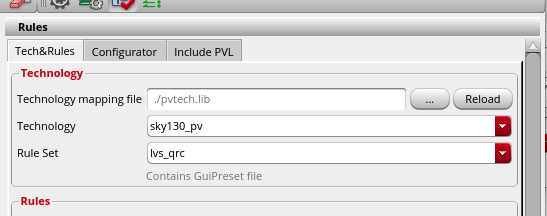
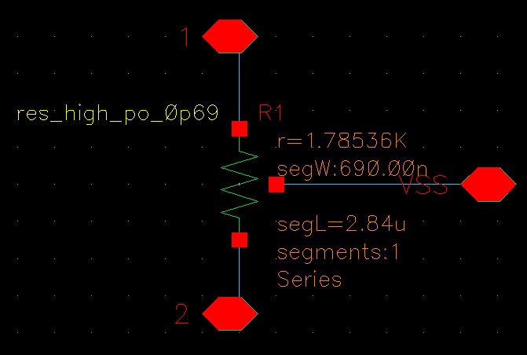

## Notes on using Virtuoso

Below are some of my notes on tricks and workarounds that I used for performing analog integrated circuit design for Tiny Tapeout using Cadence Virtuoso with the SKY130 PDK. Please note that following these steps requires significant technical and debugging expertise, because the pipeline for chip design with the SKY130 PDK in Cadence Virtuoso is currently very unstable and is not well-established. I also have not thoroughly tested these steps on a clean environment, so there may be errors.

Please contact me on Discord (@atenfyr) on the Tiny Tapeout Discord server or e-mail me at hello@atenfyr.com if you have any questions or concerns about anything written here.

### Magic VLSI setup

I used Magic VLSI for initial layout import, LEF export, and occasional workarounds for bad standard cells. The following steps were performed on Ubuntu 24.04 (either WSL or natively should work).

1. Download pre-requisites for building Magic VLSI:
    * `sudo apt update && sudo apt install m4 tcsh csh python libx11-dev tcl-dev tk-dev libcairo2-dev mesa-common-dev libgl-dev libglu1-mesa-dev zlib1g-dev libncurses-dev`

2. Download and build Magic VLSI:
    * `git clone https://github.com/RTimothyEdwards/magic.git`
    * `cd magic`
    * `./configure`
    * `make`
    * `sudo make install`
    * If needed, see more information here: https://opencircuitdesign.com/magic/install.html

3. Install the SKY130 PDK through Volare by executing the following commands:
    * If needed, install Python 3.14 (so that the copy of Python used to install volare is separate from your system's copy of Python):
        * `sudo add-apt-repository ppa:deadsnakes/ppa`
        * `sudo apt install python3.14`
    * `python3.14 -m pip install volare`
    * `export PDK_ROOT=~/.pdks`. You should also include this line in your .bashrc file or similar
    * `volare ls-remote --pdk sky130` to view a list of version hashes
    * `volare enable --pdk sky130 <version_hash>`
        * I used `0fe599b2afb6708d281543108caf8310912f54af`
    * `ln -s $PDK_ROOT/sky130A/libs.tech/magic/sky130A.magicrc .magicrc` to create a symlink for the PDK's .magicrc file in the current directory (navigate first to a desired working directory)
    * `magic` to open Magic in the current directory. If you see "Technology: sky130A" at the top of the screen, then you were successful

### Cadence Virtuoso setup

Note that the following steps do require an existing license and installation of Cadence Virtuoso. Existing licenses and installation for Cadence Pegasus and Quantus are recommended as well to perform DRC/LVS/parasitic extraction within Virtuoso.

1. Download the SKY130 PDK for Cadence Virtuoso from Cadence support (sky130_release_0.1.0.tgz). You will need to create a free account with Cadence to access the PDK. https://support.cadence.com/apex/ArticleAttachmentPortal?id=a1Od000000051TqEAI&pageName=ArticleContent

2. Upload the downloaded .tgz file(s) to the server that Cadence Virtuoso is installed on, and extract them:
    `tar -xzvf *.tgz`

3. Set up the appropriate shell script within the extracted sky130_release_0.1.0 directory for opening Cadence Virtuoso. This probably should be based on existing shell scripts for other PDKs. You also need to set a few different variables so that Virtuoso can recognize your copies of Pegasus and Quantus, if installed. For tcsh scripts, you can include the following lines (modified as needed) in your shell script to set up Pegasus and Quantus:

    ```
    setenv PEGASUS_DRC /path/to/your/sky130_release_0.1.0/Sky130_DRC
    setenv PEGASUS_LVS /path/to/your/sky130_release_0.1.0/Sky130_LVS

    setenv PATH /path/to/your/installation/of/QUANTUS241/bin:/path/to/your/installation/of/PEGASUS232/bin:$PATH
    ```

    For a bash script, something like this could work (untested):

    ```
    export PEGASUS_DRC=/path/to/your/sky130_release_0.1.0/Sky130_DRC
    export PEGASUS_LVS=/path/to/your/sky130_release_0.1.0/Sky130_LVS

    export PATH=/path/to/your/installation/of/QUANTUS241/bin:/path/to/your/installation/of/PEGASUS232/bin:$PATH
    ```


4. Execute your shell script to open Cadence Virtuoso.

5. Close Cadence Virtuoso and add the following line to your cds.lib file:

    ```
    DEFINE sky130_fd_pr_main ./libs/sky130_fd_pr_main
    ````

6. Execute your shell script again to re-open Cadence Virtuoso. You should now be able to see the sky130_fd_pr_main library in the Library Manager (Tools -> Library Manager).

7. You can create new libraries as normal; make sure to select "Attach to an existing technology library" and choose "sky130_fd_pr_main" when creating a new library. In Layout L/XL, you should be able to see new tabs called "Pegasus" and "Quantus" if Virtuoso was able to find these software.

#### Pegasus setup (DRC)
To set up Pegasus for DRC:

1. Open the Pegasus -> Run DRC... menu option within Layout L/XL.

2. Under Run Data, choose any Run Directory that you would like. Under Rules -> Tech&Rules, choose "Add..." and select the file at "SKY130_DRC/sky130_rev_0.0_2.12.drc.pvl" (or similar). You do not need to choose a technology mapping file or similar.

3. Under Rules -> Configurator, check "Use Configurator", press the "..." button and select the file at "SKY130_DRC/sky130.drc.cfg" (or similar). For Tiny Tapeout specifically, you may wish to check "Turn Off Density Rules."

4. Press "Submit" to execute a DRC run. In my experience, DRC results from Pegasus are consistently accurate. If you would like to sanity check the results, you can export a .gds file of your layout (File -> Export Stream from VM), import into Magic VLSI (within Magic, File -> Read GDS), and choose Drc -> DRC report, at which point you will receive DRC results in the interactive tcl window.

#### Pegasus setup (LVS)
To set up Pegasus for LVS, there are some additional steps (as of March 2026). These steps are based off of these troubleshooting steps by Andrew Beckett: https://community.cadence.com/cadence_technology_forums/f/custom-ic-design/65351/quantus-error-sky130-qrctechfile-not-recognized-as-valid-technology-file/1406727

1. Make sure Cadence Virtuoso is closed.

2. Create a new file called "pvtech.lib" in your working directory with the following content (modified as needed to point to the correct directory):

    ```
    DEFINE sky130_pv /path/to/your/sky130_release_0.1.0/pv
    ```

3. Navigate to the SKY130_LVS directory within your working directory, and execute `ln -s sky130.lvs.v0.0_1.1.pvl sky130.lvs.pvl`.

4. Open Cadence Virtuoso and open Layout L/XL for your design of choice. Then, open the Pegasus -> Run LVS... menu option within Layout L/XL.

5. Under Run Data, choose any Run Directory that you would like. Under Rules -> Tech&Rules, populate the window as follows (image taken by Andrew Beckett from the above guide):

    

6. Press "Submit" to execute a LVS run. In my experience, LVS results from Pegasus are generally accurate, with some minor cases where some errors will occur incorrectly (discussed under the "DRC/LVS Issues" section).

#### Quantus setup (parasitic extraction)

1. Execute the steps above for Pegasus setup for LVS.

2. Open the Quantus -> "Run Pegasus - Quantus" menu option within Layout L/XL.

3. The initial form should be autopopulated if the Pegasus setup for LVS was performed correctly. Choose "OK."

4. In the Parasitic Extraction Run Form, choose "sky130_pv" for Technology and "typical" for RuleSet. Choose "Extracted View" under Output and "av_extracted" under View.

5. Make other changes as necessary and choose "OK" to perform parasitic extraction.

6. When performing post-layout simulations with Cadence Spectre, include the word "av_extracted" before "schematic" in the view list. This can be done in a config cell view, or otherwise under Setup -> Environment if using ADE L.

### Initial project import for Tiny Tapeout

1. Follow the guides under "Instructions for creating and submitting an analog design" at https://tinytapeout.com/specs/analog/ for setting up an initial design in Magic VLSI. Use the recommended tcl script (`magic_init_project.tcl`) within the guide to set up the initial design.

2. Export your initialized magic project as a GDS file (File -> Write GDS).

3. Import the GDS file exported by Magic into Cadence Virtuoso. This can be done in the Command Interpreter Window (CIW) that first launches when opening Virtuoso by choosing File -> Import -> Stream and filling out all the fields. Choose a new library name under Library (not an existing library), skip the "Template File" field, and choose "sky130_fd_pr_main" for Attach Tech Library.

4. If the import succeeded, you should see two metal4 power strips on the left side of the screen and metal4 pins at the top and bottom of the screen (as of the current default setup in March 2026). Your final design should be performed on this cell view.

### Final project export for Tiny Tapeout

1. To export your final design, choose File -> Export Stream from VM in Layout L/XL. Download your .gds file to wherever it is needed.

2. Open Magic VLSI and open the .gds file (File -> Read GDS).

3. In the tcl command line interpreter menu, execute `load tt_um_your_project_name` and `lef write tt_um_your_project_name.lef -pinonly` (modified as needed to use the actual top-level name of your project). This command will export the .lef file.

4. Place your .lef file and .gds file in your GitHub repository as instructed as https://tinytapeout.com/specs/analog/. Your .lef file may need modifications to pass the automated DRC checks; for me, the only modification needed was the inclusion of the "USE POWER ;" line for the VDPWR pin.

### DRC/LVS Issues
Below I have tabulated some of the issues that I personally encountered with Pegasus DRC/LVS on SKY130. Other issues likely exist that are not discussed here.

* Some of the default polysilicon resistor standard cells violate DRC. I got around this by generating a polysilicon resistor layout in Magic VLSI (Devices 2 -> poly resistor, sheet resistance depending on whether you are using res_generic, res_high, or res_xhigh), exporting the layout as a .gds file, and importing the .gds file into Cadence Virtuoso. To pass LVS, you can create a schematic cell view for the imported layout that simply uses an existing polysilicon resistor model. You will need to change the width and length of this model to whatever Pegasus reports the parameters of the layout polysilicon resistor to be to pass LVS. Make sure to add labels to the layout for pins 1, 2, and VSS.

    

* I found that LVS would fail when parallel capacitors are merged together, because Pegasus does not seem to properly compute the updated equivalent width and length for the merged capacitor for either schematic or layout. This can be resolved by modifying the `sky130.lvs.v0.0_1.1.pvl` file (or similar) with the following additional rules at the end to disable merging series and parallel capacitors. Note that this does require that parallel capacitors be placed separately in your schematic.

    ```
        lvs_reduce no -parallel_caps
        lvs_reduce no -series_caps
    ```

* If you need to tie any unused output pins to VGND as directed by the Tiny Tapeout instructions, you should NOT include equivalent ties to ground in your schematic to pass LVS. In my experience, Pegasus will return "match with warnings" when multiple nets are tied together in your layout. These warnings can be ignored (with caution).

* Note that dummy transistors DO need to be drawn in your schematic for the design to pass LVS (at least by default). This is different than with Calibre, where dummy transistors are automatically filtered out and thus do not need to be included in your schematic.
